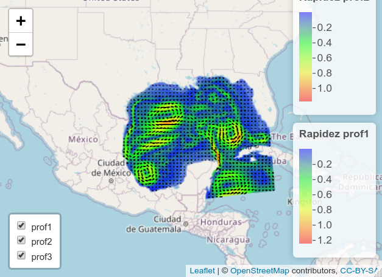
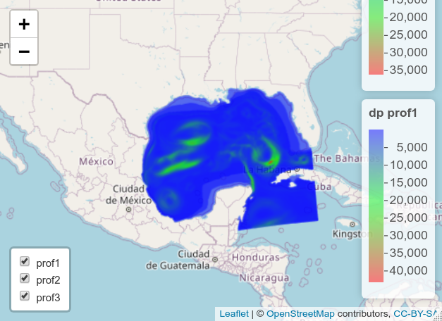

# Golfo de México

## Rapidez y velocidad en el Golfo de México

Se configuró una malla para el océano Atlántico Mexicano, que básicamente comprende el Golfo de México.

Las salidas del modelo, muestran las estructuras reportadas en el caribe mexicano, como son la corriente de lazo, liberación de remolinos al interior del Golfo de México y velocidades superficiales intensas y persistentes en la península de Yucatán, tal como se puede apreciar en la Figura \@ref(fig:Mapa03). Actualmente, se está en el proceso de una validación cuantitativa de las mismas.


```{r Mapa03, echo=F, out.width='95%', fig.show='hold', fig.cap='Rapidez y velociad de corriente en el Golfo de México'}
# source("R/RasterVels.R", chdir = T, echo = F)
if (knitr::is_latex_output()){
  
} else if (knitr::is_html_output()){
  VelMap("nc/gmex/golfomx.nc") 
}
```


Pellentesque habitant morbi tristique senectus et netus et malesuada fames ac turpis egestas. In fermentum scelerisque dui, ac volutpat nisl aliquam at. Donec dui urna, posuere egestas ligula vel, fringilla ultrices erat. Phasellus molestie fringilla massa, ac ultrices libero facilisis quis. In volutpat molestie dapibus. Vivamus non nunc nec ex elementum facilisis. Donec in purus ex. Donec interdum sollicitudin nunc ut luctus. Mauris vel finibus est, id lobortis nulla. Vestibulum ante ipsum primis in faucibus orci luctus et ultrices posuere cubilia curae; Quisque vulputate, dui sed molestie lacinia, metus ipsum volutpat odio, vitae tincidunt urna nulla quis purus. Sed posuere ex in magna ullamcorper, sit amet interdum metus venenatis.

Nullam eget lobortis urna. Maecenas ipsum lorem, cursus nec dui ut, malesuada aliquam neque. Cras quis laoreet ipsum. Donec imperdiet, diam at laoreet iaculis, nisi sapien efficitur ligula, convallis fermentum nulla velit in ipsum. Cras non aliquam augue. Curabitur ac odio eros. Mauris id condimentum augue, sed rhoncus orci. In hac habitasse platea dictumst. Vivamus viverra nisl efficitur dapibus aliquam. Vivamus fringilla, felis eu porttitor congue, orci est pulvinar eros, vitae consectetur tellus enim non urna. Suspendisse pharetra vel felis id fringilla.

Sed ex neque, egestas et sodales sed, viverra vel sem. Duis sollicitudin justo vitae dignissim dignissim. Pellentesque faucibus, tellus eget facilisis pulvinar, odio libero dapibus risus, sed vulputate orci metus vitae eros. Curabitur maximus neque in dui tempus facilisis. Vivamus sed eleifend nisi. Mauris accumsan turpis justo, et elementum enim porta nec. Aliquam rhoncus metus sed tortor pharetra, blandit bibendum metus pretium. Vivamus iaculis, dolor quis scelerisque fringilla, est lectus mollis ante, at pulvinar sapien augue sed nisi. Praesent auctor varius orci, non pharetra nunc mollis ut. Duis vulputate sodales erat, tristique sagittis libero consectetur facilisis. Donec id sapien auctor, imperdiet mauris a, volutpat tellus. Fusce non lorem eget libero pulvinar semper.

## Otras variables en el Golfo de México

Donec consequat maximus nunc, sed porttitor neque aliquet sed. In consectetur, mi sed faucibus laoreet, ex sem congue leo, eu maximus purus nisl at nunc. Quisque iaculis vehicula quam, a dictum nisl rutrum ut. Vestibulum varius gravida congue. Ut fermentum elementum libero, in malesuada sapien tempor et. Suspendisse tellus eros, placerat id velit id, tempus condimentum mi. Sed sem turpis, venenatis id sodales ut, porta vitae nibh. Donec suscipit porta lacus eu blandit.

Pellentesque habitant morbi tristique senectus et netus et malesuada fames ac turpis egestas. In fermentum scelerisque dui, ac volutpat nisl aliquam at. Donec dui urna, posuere egestas ligula vel, fringilla ultrices erat. Phasellus molestie fringilla massa, ac ultrices libero facilisis quis. In volutpat molestie dapibus. Vivamus non nunc nec ex elementum facilisis. Donec in purus ex. Donec interdum sollicitudin nunc ut luctus. Mauris vel finibus est, id lobortis nulla. Vestibulum ante ipsum primis in faucibus orci luctus et ultrices posuere cubilia curae; Quisque vulputate, dui sed molestie lacinia, metus ipsum volutpat odio, vitae tincidunt urna nulla quis purus. Sed posuere ex in magna ullamcorper, sit amet interdum metus venenatis.

```{r Mapa04, echo=F, out.width='95%', fig.show='hold', fig.cap='Variable dp en el Golfo de México'}
# source("R/RasterVels.R", chdir = T, echo = F)
if (knitr::is_latex_output()){
  
} else if (knitr::is_html_output()){
  MuestraVar("nc/gmex/golfomx.nc", "dp") 
}
```

Lorem ipsum dolor sit amet, consectetur adipiscing elit. Vivamus sollicitudin suscipit varius. Cras sit amet magna in arcu pretium malesuada non et tortor. Suspendisse potenti. Pellentesque eu ullamcorper velit, eu gravida risus. Aliquam fermentum tellus ac velit rhoncus efficitur ac eu dui. Proin urna arcu, tempus a sagittis volutpat, rutrum sed ex. Ut tempus quis ligula vitae aliquam.

Pellentesque habitant morbi tristique senectus et netus et malesuada fames ac turpis egestas. In fermentum scelerisque dui, ac volutpat nisl aliquam at. Donec dui urna, posuere egestas ligula vel, fringilla ultrices erat. Phasellus molestie fringilla massa, ac ultrices libero facilisis quis. In volutpat molestie dapibus. Vivamus non nunc nec ex elementum facilisis. Donec in purus ex. Donec interdum sollicitudin nunc ut luctus. Mauris vel finibus est, id lobortis nulla. Vestibulum ante ipsum primis in faucibus orci luctus et ultrices posuere cubilia curae; Quisque vulputate, dui sed molestie lacinia, metus ipsum volutpat odio, vitae tincidunt urna nulla quis purus. Sed posuere ex in magna ullamcorper, sit amet interdum metus venenatis.

Nullam eget lobortis urna. Maecenas ipsum lorem, cursus nec dui ut, malesuada aliquam neque. Cras quis laoreet ipsum. Donec imperdiet, diam at laoreet iaculis, nisi sapien efficitur ligula, convallis fermentum nulla velit in ipsum. Cras non aliquam augue. Curabitur ac odio eros. Mauris id condimentum augue, sed rhoncus orci. In hac habitasse platea dictumst. Vivamus viverra nisl efficitur dapibus aliquam. Vivamus fringilla, felis eu porttitor congue, orci est pulvinar eros, vitae consectetur tellus enim non urna. Suspendisse pharetra vel felis id fringilla.

Sed ex neque, egestas et sodales sed, viverra vel sem. Duis sollicitudin justo vitae dignissim dignissim. Pellentesque faucibus, tellus eget facilisis pulvinar, odio libero dapibus risus, sed vulputate orci metus vitae eros. Curabitur maximus neque in dui tempus facilisis. Vivamus sed eleifend nisi. Mauris accumsan turpis justo, et elementum enim porta nec. Aliquam rhoncus metus sed tortor pharetra, blandit bibendum metus pretium. Vivamus iaculis, dolor quis scelerisque fringilla, est lectus mollis ante, at pulvinar sapien augue sed nisi. Praesent auctor varius orci, non pharetra nunc mollis ut. Duis vulputate sodales erat, tristique sagittis libero consectetur facilisis. Donec id sapien auctor, imperdiet mauris a, volutpat tellus. Fusce non lorem eget libero pulvinar semper.

Donec consequat maximus nunc, sed porttitor neque aliquet sed. In consectetur, mi sed faucibus laoreet, ex sem congue leo, eu maximus purus nisl at nunc. Quisque iaculis vehicula quam, a dictum nisl rutrum ut. Vestibulum varius gravida congue. Ut fermentum elementum libero, in malesuada sapien tempor et. Suspendisse tellus eros, placerat id velit id, tempus condimentum mi. Sed sem turpis, venenatis id sodales ut, porta vitae nibh. Donec suscipit porta lacus eu blandit.
